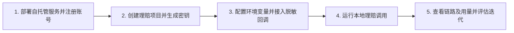

# LangFuse本地使用流程

```mermaid
flowchart LR
    account["1. 部署自托管服务并注册账号"] --> project["2. 创建理赔项目并生成密钥"]
    project --> configure["3. 配置环境变量并接入脱敏回调"]
    configure --> invoke["4. 运行本地理赔调用"]
    invoke --> inspect["5. 查看链路及用量并评估迭代"]
```

对应 `demos/langfuse_demo.py`。开启LANGFUSE_ENABLED，配置HOST、PUBLIC_KEY和SECRET_KEY。实际调用成功并在控制台看到Trace之后，才算追踪联调完成。
