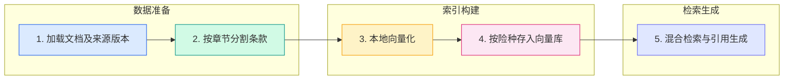

# RAG五大核心流程

```mermaid
flowchart LR
    subgraph preparation["数据准备"]
        load["1. 加载文档及来源版本"] --> split["2. 按章节分割条款"]
    end
    subgraph indexing["索引构建"]
        embed["3. 本地向量化"] --> store["4. 按险种存入向量库"]
    end
    subgraph generation["检索生成"]
        retrieve["5. 混合检索与引用生成"]
    end
    split --> embed
    store --> retrieve
    style load fill:#dbeafe,stroke:#2563eb
    style split fill:#d1fae5,stroke:#0d9488
    style embed fill:#fef3c7,stroke:#f59e0b
    style store fill:#fce7f3,stroke:#db2777
    style retrieve fill:#e0e7ff,stroke:#6366f1
```

无检索结果则返回信息不足；引用标识须属于检索候选，语义支持度由黄金数据集评估。
