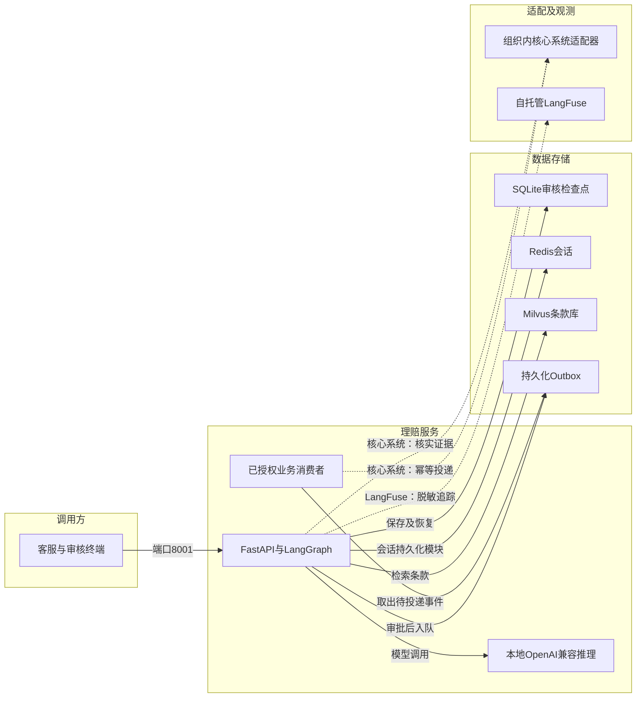

# 本地部署架构

```mermaid
flowchart LR
    subgraph client["调用方"]
        browser["客服与审核终端"]
    end
    subgraph service["理赔服务"]
        api["FastAPI与LangGraph"]
        llm["本地OpenAI兼容推理"]
        consumer["已授权业务消费者"]
    end
    subgraph datastore["数据存储"]
        checkpoints["SQLite审核检查点"]
        memory["Redis会话"]
        vectors["Milvus条款库"]
        outbox["持久化Outbox"]
    end
    subgraph external["适配及观测"]
        legacy["组织内核心系统适配器"]
        trace["自托管LangFuse"]
    end
    browser -->|"端口8001"| api
    api -->|"模型调用"| llm
    api -->|"保存及恢复"| checkpoints
    api -->|"会话持久化模块"| memory
    api -->|"检索条款"| vectors
    api -->|"审批后入队"| outbox
    consumer -->|"取出待投递事件"| outbox
    consumer -.->|"核心系统：幂等投递"| legacy
    api -.->|"核心系统：核实证据"| legacy
    api -.->|"LangFuse：脱敏追踪"| trace
```

会话、检索和Outbox是可注入模块，真实接口须配置后启用。当前HTTP示例为单工作进程；不要直接据此增加副本。
