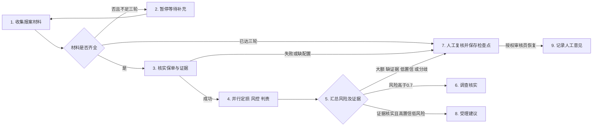

# 理赔Agent端到端状态机

```mermaid
flowchart LR
    intake["1. 收集报案材料"] --> complete{"材料是否齐全"}
    complete -->|"否且不足三轮"| supplement["2. 暂停等待补充"]
    supplement --> intake
    complete -->|"是"| policy["3. 核实保单与证据"]
    complete -->|"已达三轮"| review["7. 人工复核并保存检查点"]
    policy -->|"失败或缺配置"| review
    policy -->|"成功"| experts["4. 并行定损 风控 判责"]
    experts --> route{"5. 汇总风险及证据"}
    route -->|"风险高于0.7"| investigate["6. 调查核实"]
    route -->|"大额 缺证据 低置信 或分歧"| review
    route -->|"证据核实且高置信低风险"| accept["8. 受理建议"]
    review -->|"授权审核员恢复"| result["9. 记录人工意见"]
```

图中的结果均为审核建议，不自动付款；拒赔必须由授权审核员提供核实后的条款依据。
