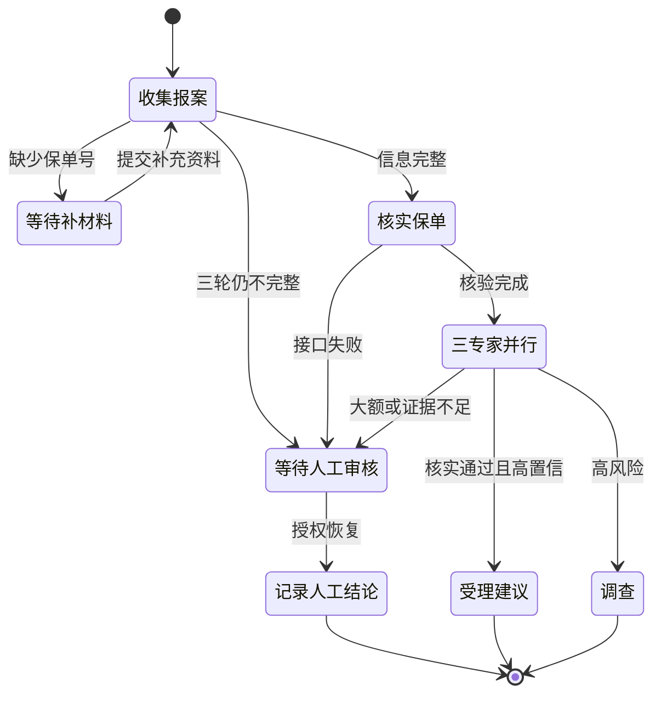

# 理赔状态与恢复

```mermaid
stateDiagram-v2
    [*] --> intake
    state "收集报案" as intake
    state "等待补材料" as waiting
    state "核实保单" as policy
    state "三专家并行" as experts
    state "等待人工审核" as review
    state "受理建议" as accept
    state "调查" as investigate
    state "记录人工结论" as complete
    intake --> waiting: 缺少保单号
    waiting --> intake: 提交补充资料
    intake --> policy: 信息完整
    intake --> review: 三轮仍不完整
    policy --> experts: 核验完成
    policy --> review: 接口失败
    experts --> review: 大额或证据不足
    experts --> accept: 核实通过且高置信
    experts --> investigate: 高风险
    review --> complete: 授权恢复
    complete --> [*]
    accept --> [*]
    investigate --> [*]
```
