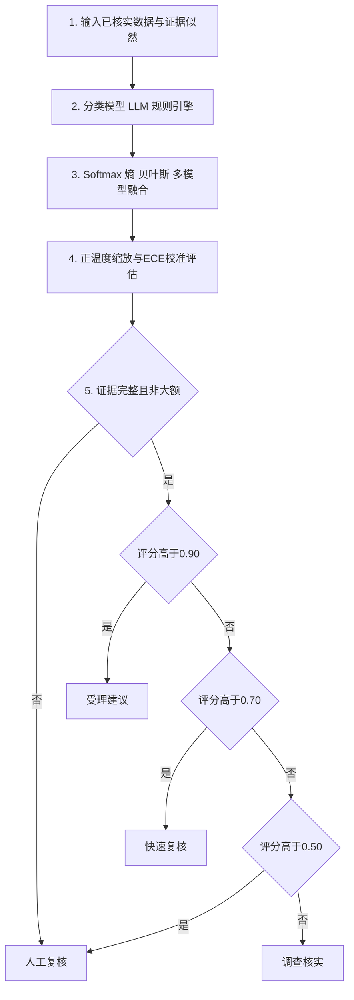

# 置信度评估系统

```mermaid
flowchart TB
    data["1. 输入已核实数据与证据似然"] --> models["2. 分类模型 LLM 规则引擎"]
    models --> confidence["3. Softmax 熵 贝叶斯 多模型融合"]
    confidence --> calibration["4. 正温度缩放与ECE校准评估"]
    calibration --> evidence{"5. 证据完整且非大额"}
    evidence -->|"否"| manual["人工复核"]
    evidence -->|"是"| high{"评分高于0.90"}
    high -->|"是"| suggest["受理建议"]
    high -->|"否"| middle{"评分高于0.70"}
    middle -->|"是"| quick["快速复核"]
    middle -->|"否"| low{"评分高于0.50"}
    low -->|"是"| manual
    low -->|"否"| investigate["调查核实"]
```

综合评分是材料的启发式算法，不等于已经校准的赔付概率。低分不自动拒赔。
